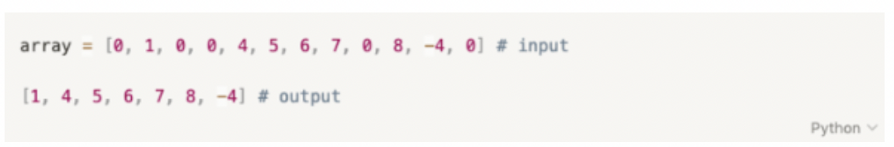

# Test Task for Tutor Python 

## Python

* What are the main differents between Python2 and Python3?

* What happens if you import the same library into the code twice?

* What is cyclic import and how can you avoid it?

* What is a context manager?

* Describe how a <b>list</b> data structure works?

## Algorithms

* Which data type in Python should I choose for the <b>items</b> container so that the operation of searching for an item is asymptotically the most efficient?
  - A set
  - A list
  - Sorted List
  - A single-linked list
  - It doesn't matter, since we'll write <b>for items in items:</b>
  - tuple

* Estimate the difficulty of quick sorting in the worst case scenario.
  
  - O(N^2)
  - O(N logN)
  - O(log(logN))

* Estimate the complexity of the operation of searching for an element in the search tre in the worst case scenario.
  
  - O(logN)
  - 0(N logN)
  - O(N^2)
  -There are no correct answers

* What is a "pyramid"

* What features should a binary tree have in order to be a search tree?

## Django

* How can I get the value of the <b>username</b> variable in the controller if it is passed from the page by the POST method?
 
    - request.POST.get('username)
    - request.POST['username']
    - request.POST.username
    - request.POST('username')

* Which command runs the development web server in Django?

    - python manage.py runserver
    - python manage.py devserver
    - python run server
    - python devserver run

* What arguments in this code are passed to the view function?

    <b>path('/example/<int:id>/', example_view)</b>

    - Named int argument that has an id type
    - Named id argumnet tha has an int type
    - Positioned int argument that has an id type
    - Positioned id argument that has and int type

* You need to write a controller that returns data from the database in the form of an object. On the basis of which class would you create it?

    - ListView
    - DetailView
    - RetrieveView
    - GetView

* You have changed the models in a project. What commands do you need to run to commit changes and start migrations?

* What is middleware?

## SQL

* What types of JOIN queries in SQL do you know? Describe them and specify the differences beetween them.

* There are two tables: A and B. The first table has 4 columns and 10 records, and the second one has 5 columns and 8 records. How many rows an columns willbe output with the
<b>select * from A,B</b> query, and why?

* Indicate the main differences between SQL and NOSQL databases. Give examples how both of them can be used and explain your choice

## General questions

* You need to write Python code that will send user's comments to a certain forum. Which requeste method would you choose for this - GET, POST, of PUT? Explain you choice

* Explain which is better: inheritance of composition. Why?

* Explain how authentication differs from authorization

* What is versioning used for when creating REST API services?

* What HTTP methods do you know?

* Suggest several options for scaling your service

* What ways do you know for changing file access rights in Linux?

* List the main differencecs between the process and the flow?

* What ways of iteration between processes do you know?

* You tiped a 6-character command in the terminal and received the name of the current directory in response. Is this possible?

* What types of DNS records do you know?

* 0 STDIN, 1 STDOUT, 2 STDERR -- what does it mean?

* What is the name of the DNS record for IPv6?

## Writing code

- Task 1.
There are two list: you need to return the elements that are in the first list, but are missing in the second. Evaluate the effectiveness of your solution.

- Task 2.
There is an array of integers. You need to remove the zeros from it. Only O(1) of additional memory can be used. Example:

  

You can leave your answeras a link to your repository in GitHub

[Task Solutions](https://github.com/romica44/Practicum_Python_Test/blob/main/CodeTask.py)

  Code Task Solutions
  <a href src="https://github.com/romica44/Practicum_Python_Test/blob/main/CodeTask.py" />

## Others

* Why do you want to become a Tutor in Practicum?

* What competencies do you think a good tutor in your profession should have? Explain your opinion. Give examples from your own experience

* Where did you study back-end development and how did you get into this profession?

  The answers to all questions
  <a href src="./TestAnswers.docx" />

